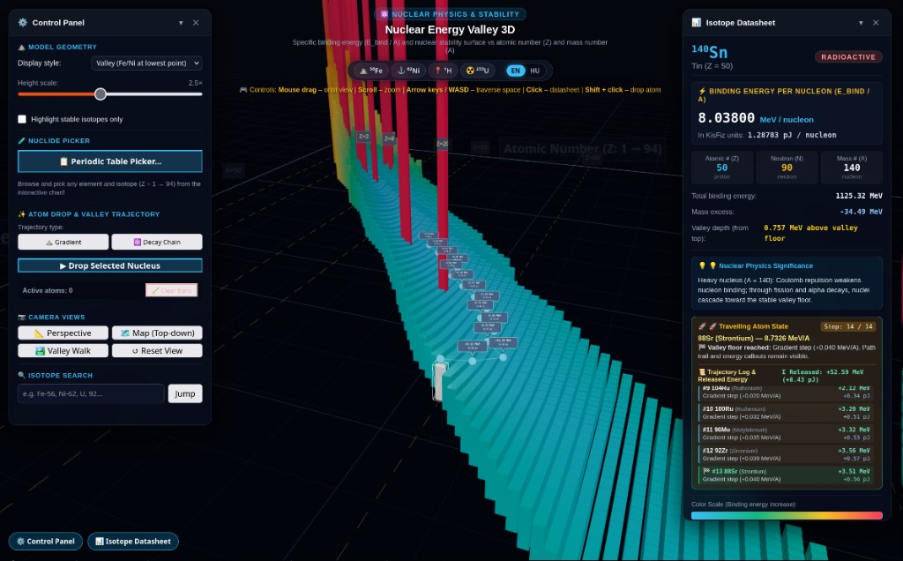

# Nuclear Energy Valley 3D (Nuclear Valley WebGL)

[](LICENSE)
[](https://threejs.org/)
[](https://vitejs.dev/)
[](#internationalization-i18n)

An interactive, walkable 3D WebGL / Three.js visualization of the nuclear specific binding energy valley and stability body, covering 3,078 isotopes across the first 94 elements of the periodic table (from Hydrogen to Plutonium).

Inspired by the educational curriculum of [KisFiz Interactive Energy Valley](https://kisfiz.hu/nuclear-physics/interactive-energy-valley/), and sharing visual design principles with the sibling `/web/visualisation` quantum simulation system.



---

## 🌐 Live GitHub Pages Links

- ⚛️ **Interactive 3D WebGL Simulator**: [https://lowcoders.github.io/nuclear_valley/app/](https://lowcoders.github.io/nuclear_valley/app/)
- 📖 **English Documentation**: [https://lowcoders.github.io/nuclear_valley/en/](https://lowcoders.github.io/nuclear_valley/en/)
- 📖 **Hungarian Documentation**: [https://lowcoders.github.io/nuclear_valley/](https://lowcoders.github.io/nuclear_valley/)

---

## Table of Contents

1. [Physical Concept & Mathematical Background](#physical-concept--mathematical-background)
2. [Key Features](#key-features)
3. [Interactive Controls](#interactive-controls)
4. [Nuclear Trajectory Engine (Atom Drop)](#nuclear-trajectory-engine-atom-drop)
5. [Periodic Table Nuclide Picker](#periodic-table-nuclide-picker)
6. [Internationalization (i18n)](#internationalization-i18n)
7. [Installation & Quick Start](#installation--quick-start)
8. [Project Architecture](#project-architecture)

---

## Physical Concept & Mathematical Background

### Why Does It Form a Valley?

Due to the attractive strong nuclear force, binding free protons and neutrons into a composite atomic nucleus releases substantial binding energy ($E_\text{bind} > 0$). The average bound state energy per nucleon is lower than that of a free, unbound nucleon:

$$
E_\text{nucleon} = - \frac{E_\text{bind}}{A}
$$

Plotting this energy across the nuclear chart as a function of atomic number ($Z$) and mass number ($A$) produces a characteristic river valley shape:

- **Free Proton ($^{1}\text{H}$)**: No nuclear binding exists between nucleons ($E_\text{bind} / A = 0$). It constitutes the highest summit of the valley landscape.
- **Valley Basin ($^{56}_{26}\text{Fe}$ and $^{62}_{28}\text{Ni}$)**: Nucleons achieve their deepest, most tightly bound state:
  - $^{56}\text{Fe}$: $8.79036\text{ MeV/nucleon} \approx 1.40837\text{ pJ/nucleon}$
  - $^{62}\text{Ni}$: $8.79456\text{ MeV/nucleon} \approx 1.40904\text{ pJ/nucleon}$ (the absolute highest specific binding energy known in nature).
- **The Driver of Nuclear Transformations**: Systems naturally evolve toward lower energy states (deeper binding). Light nuclei gain energy through **fusion** by moving up the mass curve toward iron, while heavy actinides release energy through **fission** and alpha cascades by splitting into mid-mass fragments.

### Unit Conversion

Nuclear physics conventionally employs mega-electronvolts (MeV), whereas standard SI pedagogy often references picojoules (pJ):

$$
1\text{ MeV} = 10^6\text{ eV} = 1.602176634 \times 10^{-13}\text{ J} = 0.1602176634\text{ pJ}
$$

Both units are computed from the IAEA AME2020 evaluation and displayed concurrently in the telemetry HUD.

---

## Key Features

- **Authoritative AME2020 Nuclear Database**: 3,078 distinct isotopes ($Z = 1 \dots 94$) derived from the official IAEA / AMDC Atomic Mass Evaluation (2021).
- **GPU-Accelerated 3D Instanced Mesh**: All 3,078 nuclide bars render in a single WebGL draw call maintaining a steady 60 FPS, with precomputed gradient palettes.
- **Unified Simultaneous Navigation**:
  - OrbitControls mouse rotation and zooming remain active at all times.
  - Arrow keys and `WASD` keys simultaneously translate the camera and focus target through 3D space.
- **Optimized Initial 45-Degree Vantage Point**: Aligned along the horizontal axis of the valley to show both steep light-mass ridges and heavy-mass plateaus simultaneously.
- **Dual Representation Modes**:
  - *Valley Mode (default, intuitive)*: Deeper bars indicate stronger binding; Fe-56 and Ni-62 sit at the deepest basin.
  - *Peak Mode*: Traditional column graph where bar height directly equals numerical binding energy.
- **Interactive 18-Column Periodic Table Picker**: Full IUPAC grid with color-coded categories, expandable isotope drawers, and instant one-click drop or highlight.
- **Magic Numbers Coordinate Grid**: Distinctive dashed markers for closed nuclear shells: $Z = 2, 8, 20, 28, 50, 82$.

---

## Interactive Controls

| Action | Control / Key |
|---|---|
| **Rotate view (Orbit)** | Click & drag with mouse left button |
| **Zoom in / out** | Mouse scroll wheel |
| **Traverse 3D space** | `Arrow keys` or `W`, `A`, `S`, `D` (works simultaneously with mouse) |
| **Vertical elevation** | `Q` / `Space` (up), `E` / `C` (down) |
| **Fast movement (boost)** | Hold `Shift` while moving |
| **Select isotope** | Click any 3D bar |
| **Drop atom into valley** | `Shift + Click` or `Double-Click` any 3D bar, or click `▶ Drop Selected Nucleus` |
| **Pause / Resume animation** | Click `⏸ Pause` / `▶ Resume` button |
| **Language switcher** | Toggle `[EN]` / `[HU]` in the top header |

---

## Nuclear Trajectory Engine (Atom Drop)

Users can drop any isotope into the valley from altitude ($Y + 24$). The atom falls via simulated gravity onto its initial nuclide bar, then hops along a sequence of transitions toward the stability basin:

1. **Gradient Mode**: Follows the steepest local ascent in binding energy per nucleon ($\Delta E_\text{bind}/A$) across neighboring coordinates.
2. **Decay Chain Mode**: Follows discrete physical reaction channels:
   - **Nuclear Fission**: Heavy actinides ($Z \ge 90$) split into medium-mass fragments (e.g. $^{235}\text{U} \to ^{96}\text{Zr}$).
   - **$\alpha$-decay**: Emission of $^{4}\text{He}$ ($\Delta Z = -2, \Delta A = -4$).
   - **$\beta^{-}$ / $\beta^{+}$ / EC**: Isobaric conversions ($\Delta Z = \pm 1, \Delta A = 0$).
   - **Stellar Fusion & Capture**: Light nuclei capture protons, neutrons, or alpha particles climbing the curve of binding energy.
3. **Persistent 3D Path Trails & Energy Badges**: A vibrant 3D path trail and step-by-step departing energy badges (+MeV / +pJ) trace the entire voyage and stay permanently visible in the valley until a new drop begins or trails are manually cleared.
4. **Playback Control**: The drop button transforms into a `Pause` / `Resume` control during active simulation.

---

## Periodic Table Nuclide Picker

Clicking the `📋 Periodic Table Picker...` button opens a popup modal with:
- Standard 18-column grid containing all 94 elements with chemical symbols and full localized names.
- Lanthanide ($Z = 57..71$) and Actinide ($Z = 89..94$) rows.
- Interactive isotope drawer displaying all known isotopes for the selected element with mass numbers, binding energies, and stability tags.
- Direct `📍 Highlight in Valley` and `▶ Drop into Valley` action buttons.

---

## Internationalization (i18n)

The application provides first-class support for both **English (default)** and **Hungarian**. State is persisted automatically across browser sessions in `localStorage`.

All UI components update reactively upon switching languages:
- Application headers, subtitles, tooltips, and keyboard control hints.
- Control Panel options, buttons, and telemetry labels.
- Display Panel physics explanations, composition stats, and walker status.
- Periodic Table chemical element names, categories, and buttons.
- 3D coordinate frame billboard sprites.
- Isotope search bar supporting queries in English (`iron`, `lead`, `gold`, `hydrogen`, `uranium`) and Hungarian (`vas`, `olom`, `arany`, `hidrogen`, `uran`).

---

## Installation & Quick Start

```bash
# Clone or navigate to the repository
cd /web/nuclear_valley

# Install dependencies
npm install

# Start development server with hot-reload
npm run dev

# Build production bundle
npm run build

# Preview production build locally
npm run preview

# Deploy using .env configuration
npm run deploy
```

For detailed manual installation instructions, web server configuration (Nginx, Apache, Docker), and troubleshooting, refer to [INSTALL.en.md](INSTALL.en.md).

---

## Project Architecture

```
/web/nuclear_valley/
├── index.html                    # Root HTML document with UI mount points & header
├── package.json                  # Dependencies & npm scripts
├── .env.example                  # Environment template for ports & deployment
├── .env                          # Local environment variables
├── .github/workflows/ci-cd.yml   # Automated GitHub Actions build & deploy pipeline
├── README.md                     # Central documentation index
├── README.en.md                  # Detailed English documentation (this file)
├── README.hu.md                  # Detailed Hungarian documentation
├── INSTALL.en.md                 # Manual installation guide (English)
├── INSTALL.hu.md                 # Manual installation guide (Hungarian)
├── scripts/
│   ├── build-isotope-data.mjs    # Parser compiling raw AME2020 data to JSON
│   └── deploy.sh                 # Deployment script reading .env
├── public/data/isotopes.json     # Processed dataset of 3,078 isotopes
└── src/
    ├── main.js                   # Application bootstrap and reactive wiring
    ├── core/
    │   ├── Engine.js             # Three.js engine with unified Orbit + keyboard navigation
    │   ├── i18n.js               # Reactive internationalization engine (EN/HU)
    │   ├── PathPlanner.js        # Gradient descent & nuclear reaction channel planner
    │   ├── DropManager.js        # Multi-atom drop orchestrator with Play/Pause state
    │   ├── InteractionManager.js # Throttled raycaster & click/double-click dispatcher
    │   ├── SyncEngine.js         # Simulation clock & harmonic phase coordinator
    │   └── VisualComponent.js    # 3D lifecycle base class
    ├── components/
    │   ├── EnergyValley.js       # 3,078 nuclide bars InstancedMesh with cached colors
    │   ├── AtomWalker.js         # Animated glowing nuclide mesh with badge & light
    │   ├── PathTrail.js          # Persistent 3D trail lines & energy callout badges
    │   ├── ValleyAxes.js         # Localized coordinate frame & magic number markers
    │   └── GroundPlane.js        # Sci-fi floor grid
    ├── data/
    │   └── IsotopeStore.js       # Indexed database, filters, and bilingual search
    └── ui/
        ├── BasePanel.js          # Glassmorphic panel base component
        ├── ControlPanel.js       # Left-hand settings & controls HUD
        ├── DisplayPanel.js       # Right-hand scientific isotope telemetry HUD
        ├── PeriodicTableModal.js # 18-column interactive IUPAC periodic table modal
        └── styles.css            # Sci-fi glassmorphic CSS tokens & layout
```
