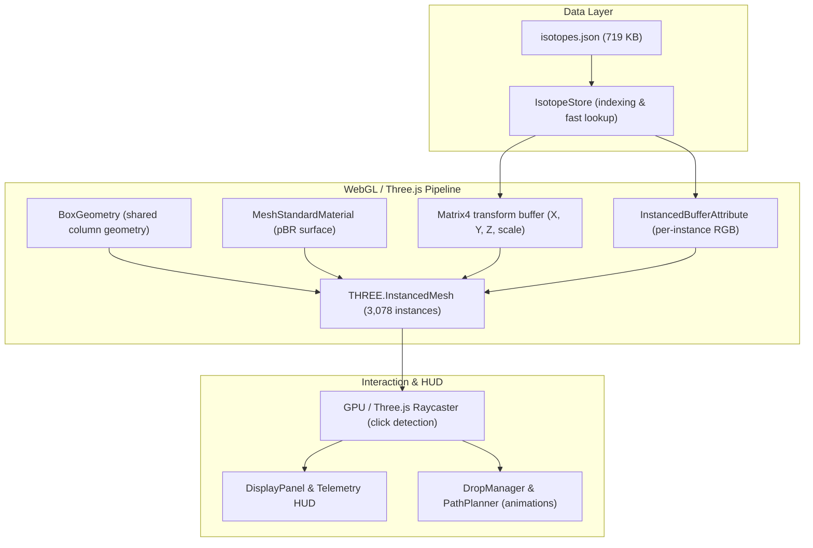

# Database & Architecture

**Nuclear Energy Valley 3D** is engineered strictly from verified nuclear evaluations and built on a high-performance WebGL graphics pipeline.

---

## 1. The IAEA / AMDC AME2020 Dataset

The application utilizes the latest official atomic mass evaluation:
- **Reference**: *Atomic Mass Evaluation 2020* (AME2020), International Atomic Energy Agency (IAEA) and Atomic Mass Data Center (AMDC).
- **Publication**: Chinese Physics C 45 (2021).
- **Nuclide Coverage**: Elements $Z = 1 \dots 94$ (Hydrogen to Plutonium).
- **Total Dataset**: Exactly **3,078 evaluated isotopes**.

### Data Ingestion Pipeline

The project includes an automated preprocessing script:
```bash
npm run build:data
# Runs scripts/build-isotope-data.mjs
```

This script parses the raw AMDC tables (`data/raw/mass_1.mas20.txt` and `data/raw/massround.mas20.txt`) and compiles a production JSON bundle at `public/data/isotopes.json`:

```json
{
  "z": 26,
  "n": 30,
  "a": 56,
  "symbol": "Fe",
  "name": "Iron",
  "bindingEnergyPerA": 8.79036,
  "bindingEnergyPerA_pJ": 1.40837,
  "massExcess": -60605.4,
  "stable": true,
  "halfLife": "stable",
  "decayMode": null
}
```

---

## 2. Graphics Pipeline & InstancedMesh Architecture

Rendering over 3,000 distinct 3D objects with individual meshes would bottleneck CPU draw calls and lower frame rates. The engine uses **InstancedMesh** architecture:



### Benefits:
1. **Single Draw Call**: All 3,078 columns render simultaneously in one GPU invocation.
2. **Solid 60 FPS**: Smooth performance across low-power laptops and mobile devices.
3. **GPU Color Mapping**: Gradient palettes are computed once into color buffers, avoiding runtime recalculations.

---

## 3. Modular Architecture

Source code is strictly organized inside `src/`:

- `src/core/Engine.js`: Central Three.js scene, camera, lighting, and animation loop manager.
- `src/core/FlyController.js`: Hybrid OrbitControls and keyboard traversal engine.
- `src/core/i18n.js`: Reactive bilingual localization engine with localStorage persistence.
- `src/core/PathPlanner.js`: Pathfinding algorithms for radioactive decay chains and gradient descent.
- `src/core/DropManager.js`: Physics particle drops and trajectory hop animations.
- `src/data/IsotopeStore.js`: Dataset ingestion, indexing, and search queries.
- `src/components/EnergyValley.js`: InstancedMesh column lifecycle and dynamic elevation morphing.
- `src/components/ValleyAxes.js`: Coordinate grids, measurement scales, and magic number indicators.
- `src/ui/ControlPanel.js`: Simulation controls (valley/peak mode, speed, drop trigger).
- `src/ui/DisplayPanel.js`: Telemetry HUD and nuclide datasheet.
- `src/ui/PeriodicTableModal.js`: 18-column interactive IUPAC table modal.
