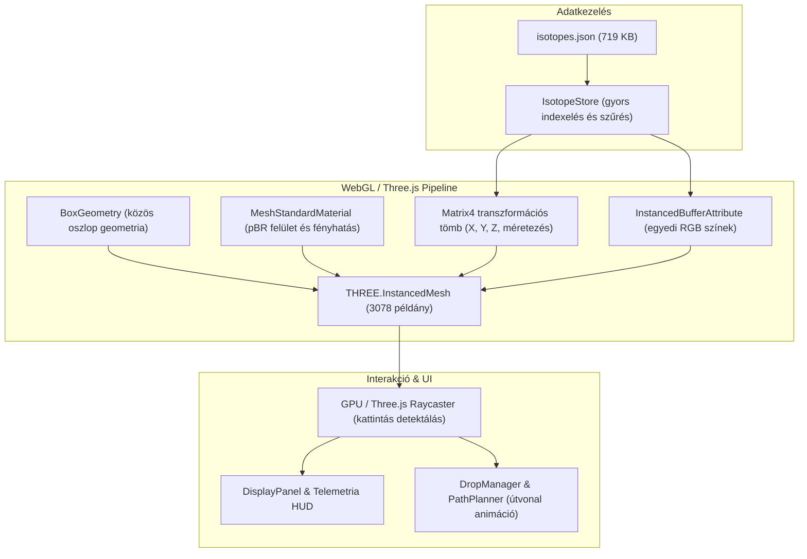

# Adatbázis és Architektúra

A **Nukleáris Energiavölgy 3D** kizárólag hivatalos, kísérletileg ellenőrzött nukleáris fizikai adatokra épül, és modern WebGL grafikus architektúrát használ.

---

## 1. Az IAEA / AMDC AME2020 Adatkészlet

Az alkalmazás a legfrissebb hivatalos magtömeg-kiértékelést használja:
- **Forrás**: *Atomic Mass Evaluation 2020* (AME2020), Nemzetközi Atomenergia-ügynökség (IAEA) és Atomic Mass Data Center (AMDC).
- **Megjelenés**: Chinese Physics C 45 (2021).
- **Kiterjedés**: A periódusos rendszer első 94 eleme ($Z = 1 \dots 94$, Hidrogéntől a Plutóniumig).
- **Elemszám**: Pontosan **3078 izotóp** kísérleti adatai.

### Nyers Adatok Feldolgozása

A projekt tartalmaz egy előfeldolgozó Node.js szkriptet:
```bash
npm run build:data
# Futattja a scripts/build-isotope-data.mjs szkriptet
```

Ez a parancs beolvassa a `data/raw/mass_1.mas20.txt` és `data/raw/massround.mas20.txt` fájlokat, kinyeri belőlük az alábbi mezőket, és egy optimalizált, tömör JSON állományt állít elő a `public/data/isotopes.json` címen:

```json
{
  "z": 26,
  "n": 30,
  "a": 56,
  "symbol": "Fe",
  "name": "Iron",
  "bindingEnergyPerA": 8.79036,
  "bindingEnergyPerA_pJ": 1.40837,
  "massExcess": -60605.4,
  "stable": true,
  "halfLife": "stable",
  "decayMode": null
}
```

---

## 2. Grafikus és Renderelési Architektúra

Egy 3000 feletti 3D objektumból álló interaktív tér kirajzolása egyedi Three.js Mesh-ekkel magas CPU-GPU sávszélességet és alacsony képkockasebességet okozna. Emiatt a rendszer **InstancedMesh** technikát alkalmaz.



### Előnyök:
1. **Egyetlen Draw Call**: Mind a 3078 oszlop egyetlen GPU hívással renderelődik.
2. **60 FPS Stabilitás**: Még régebbi integrált grafikus vezérlőkön és mobil eszközökön is folyamatos a megjelenítés.
3. **Dinamikus Színátmenetek**: A stabilitási völgy mélysége alapján előre kiszámított viridis/kék-arany színpaletta GPU pufferből olvasódik.

---

## 3. Komponens-Struktúra

A forráskód tiszta moduláris felépítést követ a `src/` könyvtárban:

- `src/core/Engine.js`: A Three.js színtér, kamera, megvilágítás és renderelési ciklus fő kezelője.
- `src/core/FlyController.js`: Kombinált Orbit és repülős kameravezérlés.
- `src/core/i18n.js`: Kétnyelvű nyelvi motor állapotkezeléssel és felirat-fordításokkal.
- `src/core/PathPlanner.js`: Fizikai bomlásláncok és gradiens minimumkereső útvonal-algoritmusok.
- `src/core/DropManager.js`: Szabadesés-fizika és atomugrások animálása.
- `src/data/IsotopeStore.js`: Az izotópadatbázis betöltése, indexelése és lekérdezése.
- `src/components/EnergyValley.js`: Az InstancedMesh oszlopok létrehozása és animálása.
- `src/components/ValleyAxes.js`: Koordinátatengelyek, mértékegység-skálák és mágikus számsávok.
- `src/ui/ControlPanel.js`: Szimulációs vezérlőpult (módváltás, sebesség, ledobás indítás).
- `src/ui/DisplayPanel.js`: Részletes telemetria és izotóp adatlap.
- `src/ui/PeriodicTableModal.js`: 18 oszlopos IUPAC periódusos rendszer modal ablak.
